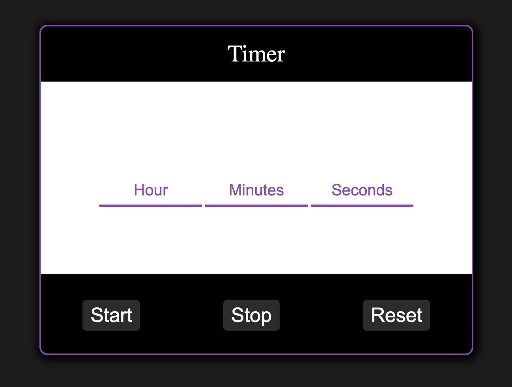

# Teast task for amoCRM

## Задание 1

Напишите реализацию таймера.

Шаг анимации таймера 1 секунда.

Форматирование таймера “hh:mm:ss”.

Например 01:12:59 - один час, 12 минут, 59 секунд.

____

В первом варианте еще можно сделать, чтобы менялись час, часы, минута, минуты и т.д. Для это нужно новую функцию сделать, как вариант и в вывод добавить сти слова, например в виде массива.

Я посчитал, что это хардкодинг и некое не очень элегантное решение. По этой причине просто зделал свой вариант таймера обратного отсчета.
___
### Мой вариант таймера
Примечания:

1. Вообще можно было бы просто поставить type="number" для input. Тоже бы печатались только цифры, но раз вы просили реализовать это отдельной функций, сделал это и в своем варианте.

Добавил кнопки Reset и Stop, что на мой взгляд в том или ином виде должно присутствовать в втаких вещах. Ну и немного стилизовал.

Поле вывода разбито на три зоны: Часы, минуты, секунды, что понятно любому юзеру и избавляет от необходимости прописвать лишние слова. Так приложение становится более универсальным и понятным для любого человека. В противном случае пришлось бы добовлять слова для разных языков других стран, что совсем не удобно и превратило бы код в кошмар.
___
#  По поводу второго задания
Там вы просили сверстать страницу по макету

У меня на гите несколько довольно больших проектов и большой версткой, все как раз на React. Если вам этого не хватит, то я конечно могу это сверстать, но это занимает довольно много времени, а раз мы тут не реализуем никакой функцион, то зачем.

Посмотрите эти ссылки:

1. https://github.com/nnikonov008/Booking-site
2. https://github.com/nnikonov008/Pizza-online-shop

Они были и в резюме. Вам более интереса будет первая. За основу дизайн взят с оригинального Booking.